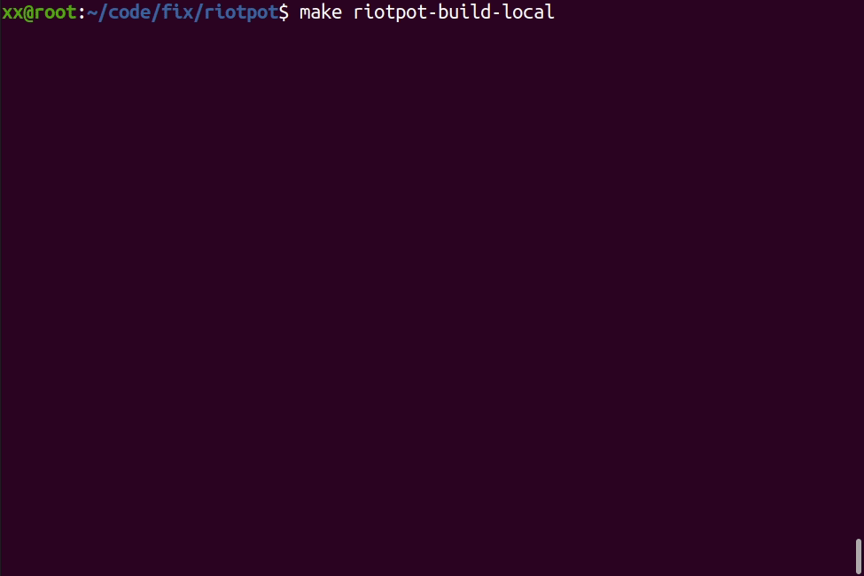

| :warning: WARNING: This branch is archived |
| --- |

<div align="center">
  
  <p align="center">
    <h2 align="center">RIoTPot</h2>
  </p>
  <p align="center">
    <!-- Workflow status -->
    <a href="https://github.com/aau-network-security/RIoTPot/actions"></a>
    <a href="https://goreportcard.com/badge/github.com/aau-network-security/RIoTPot"></a>
    <a href="https://pkg.go.dev/riopot"></a>
    <a href="">
  </p>
</div>
___

- [1. Description](#1-description)
  - [1.1 Architecture](#11-architecture)
  - [1.2 Noise Filter](#12-Noise-Filter)
- [2. Requirements](#2-requirements)
- [3. Installation](#3-installation)
  - [3.1 Local Build](#31-local-build)
  - [3.2 Containerized Build](#32-containerized-build)
  - [3.3 Via Docker Hub Image](#33-via-docker-hub-image)
- [4. Documentation](#4-documentation)
- [5. Easy Access](#5-easy-access)

## 1. Description

RIoTPot is a hybrid interaction honeypot, primarily focused on the emulation IoT and OT protocols, although, it is also capable of emulating other services. 
In essence, RIoTPot acts as a proxy service for other honeypots included in the system. 
Therefore, you can run any honeypot and other services alongside RIoTPot. 
In addition, there is an UI web-application that you can use to manage your routing.

Moreover, riotpot comes with multiple low-interaction services ready to use. 
Since these services are written as [plugins](https://pkg.go.dev/plugin), they are only supported on Linux, however, you can start riotpot without them.
The following table contains the list of services included in riotpot by defaul, their internal port, and proxy port.

<center>

| Service | Internal Port | Proxy Port |
|---------|---------------|------------|
| Coap | 25683 | 5683 |
| Echo | 20007 | 7 |
| HTTP | 28080 | 8080 |
| Modbus | 20502 | 502 |
| MQTT | 21883 | 1883 |
| SSH | 20022 | 22 |
| Telnet | 20023 | 23 | 

</center>

### 1.1 Architecture

RIoTPot has a modular architecture that facilitates extensibility of the honeypot. The honeypot further offers a hybrid-interaction capability where users can choose the desired interaction levels for the protocols simulated. The image below shows the high/level architecture of RIoTPot.


The architecture contains 6 components.

**RIoTPot core**
The core of the honeypot consists of the required modules for configuration, administration and orchestration of the container network.

**Configuration & Orchestration**
The configuration module provides RIoTPot with all the required parameters at startup. This includes the user preferences for specific protocols and profile simulation and the desired interaction level. The orchestration module is responsible for the network management from the core to the high-interaction protocol services simulated on containers. The received attack traffic is forwarded to the respective container that hosts the protocol on which the attack was targeted. Furthermore, the orchestra tor also facilitates the communication to the containers if they are hosted on a cloud-based environment.

**Attack Capture and Noise Filter**
The attack capture and noise filter module filters out the suspicious traffic received from Internet-wide scanners like Shodan and Censys. This helps the administrator to concentrate on attacks that are not from benign sources.

**Hybrid-Interaction (Low and High-Interaction modes)**
RIoTPot is implemented in Go language \cite{go} and facilitates the modular architecture and development through packages. The packages act as plug-ins that can be added to the honeypot to extend the protocols simulated. RIoTPot offers a hybrid-interaction model with a preference of low- or high-interaction.
The low-interaction is achieved through independent packages, with each package simulating a specific protocol. The high-interaction model is realized with a containers with the protocols simulated as services installed. The containers act as high-interaction modules that offer a full implementation of the protocol. Additional protocol services can be added by integration of containers with desired protocol services. The hybrid-interaction model further allows the user to emulate selective protocols on low or high-interaction levels. For example, the user can choose to have SSH in low-interaction mode and MQTT in high-interaction mode thereby operating in a hybrid-interaction mode.

**Attack Database**
The attack database stores all the attack traffic received on the honeypot. The database is setup as an independent module to ensure data availability even if the honeypot crashes on potential large scale attacks. The database is accessible from the low-interaction and high-interaction modules for attack storage.

### 1.2 Noise Filter

The Noise filter module of RIoTPot filters the attacks from internet scanning engines to reduce alert fatigue.
With this feature, attacks are labelled as **_benign_** when they originate from sources like Shodan. The
list of scanning services filtered by RIoTPot is below:

1.  Shodan (https://www.shodan.io/)
2.  Censys (https://censys.io/)
3.  Project Sonar (https://www.rapid7.com/research/project-sonar/)
4.  LeakIX (https://leakix.net/)
5.  ShadowServer (https://www.shadowserver.org/)
6.  RWTH Aachen (http://researchscan.comsys.rwth-aachen.de/)
7.  Quadmetrics (https://www.quadmetrics.com/)
8.  BinaryEdge (https://www.binaryedge.io/})
9.  ipip.net (https://en.ipip.net/)
10. Arbor Observatory (https://www.arbor-observatory.com/)
11. CriminalIP (https://security.criminalip.com/)
12. BitSight (https://www.bitsight.com/)
13. InterneTT (http://www.internettl.org/)
14. ONYPHE (https://www.onyphe.io/)
15. Natlas (https://github.com/natlas/natlas)
16. Net Systems Research (https://www.netsystemsresearch.com/)
17. Sharashka (https://sharashka.io/data-feeds)
18. Alpha Strike Labs (https://www.alphastrike.io)
19. Stretchoid (http://stretchoid.com/)

Note: the list will be updated on support for additional scanning sources.

> **Summary:** To summarize, the design of RIoTPot facilitates modularity through packages and containers as plugins. Furthermore, the modular architecture helps in achieving a hybrid-interaction model.

## 2. Requirements

Make sure that you abide by the following software and platform requirements before running RIoTPot:

- Ubuntu
- [Golang ^V1.16](https://go.dev/dl/)

## 3. Installation

Although one can download the binaries and configuration files containing the set of default running emulators, this guide is mainly focused to those looking for a customized experience.

We thrive on the idea of making RIoTPot highly transportable, therefore, in this section one can find multiple methods of installation for diverse environments that fit a broad list of requirements and constrains.

There are multiple ways to run RIoTPot, one can choose to go for local build mode or containerized mode. In local build mode the RIoTPot core runs on host machine and has options to run IoT, OT or other protocols both in local plugins or as a separate containerized service. Running RIoTPot in a virtualized/containerized self-contained network mode using `Docker` is highly recommended.

<!-- > **NOTE:** The production image can be pulled from Docker Hub. If you choose this method you may directly jump to [2.1 Docker](#21-docker).
 -->

Follow the steps to get the RIoTPot project first:

```bash
# 1. Clone the repository
$ git clone git@github.com:aau-network-security/riotpot.git

# 2. Navigate to the newly created directory with the repository
$ cd riotpot
```

### 3.1 Local Build

Make sure user meets the dependency requirements before running RIoTPot, specially MongoDB instance, User can follow this [guide for quick MongoDB setup](https://abresting.github.io/posts/2021/MongoDB-QuickSetup/):

To build RIoTPot locally, follow the steps:

```bash
# Running the following command from RIoTPot directory will compile the necessary plugins and binaries
# and put it in the standard go path as well as in current directory.
$ make RIoTPot-build-local

# Command will run the RIoTPot locally
$ ./RIoTPot
```



Upon running, user needs to select the mode of interaction, in Low mode, all plugins run locally as binaries, in High mode, the selected services run in separate container, and, in Hybrid mode, mix of Low and High i.e. some services locally and some inside containers.

In every mode, there is an option to run the services directly from reading the configuration file located at `config/samples/configuration.yml`


By editing the `boot_plugins` tag, services to run as binaries inside can be provided, see `emulators` tag in the same configuration file to input allowed service plugins only

By editing the `start_images` tag, services to run inside a container can be provided, see `images` tag in the same configuration file to input allowed container images only

> **Not for Local build**, by editing `mode` tag, the RIoTPot running mode can be provided

To exit the RIoTPot in it's running state at any time press `Ctrl + C`

### 3.2 Containerized Build

In containerized build, RIoTPot core is also deployed inside a container and forwards traffic to the other services.

To build inside containers, follow the steps:

```bash
# Assuming user is at root directory of the RIoTPot github repository
$ cd RIoTPot/deployments

# Run the command to enter the interactive mode to choose services to run
$ go run interactive_deployer.go
```


Upon choosing modes and services correctly, following message will be displayed:

```
Perfect!, now run the command
  docker-compose -f docker-compose.yml up -d --build

```

```bash
# This will setup the container environment and run the services along
# with database and other useful containers
$ docker-compose -f docker-compose.yml up -d --build
```

To check if the containers are correctly setup, check with the following command and see,
if `RIoTPot:development` and other selected service containers are up and running.

```bash
$ docker ps
```

#### Alternatively

One can also setup the Containerized RIoTPot through config file located at, `config/samples/configuration.yml`


By editing the `boot_plugins` tag, services to run as binaries inside can be provided, see `emulators` tag in the same configuration file to input allowed service plugins only

By editing the `start_images` tag, services to run inside a container can be provided, see `images` tag in the same configuration file to input allowed container images only

By editing `mode` tag, the RIoTPot running mode can be provided, see `allowed_modes` tag in the same configuration file to input allowed modes only

To stop the RIoTPot in Containerized mode use the following command:

```bash
$ docker-compose down -v
```

> **NOTE:** Using the _-v_ tag will remove all the mounted volumes, i.e. the database used by RIoTPot to store information and the volumes mounted to store logs and binaries collected by the honeypot. Remember to make copies before using the _-v_ tag, or skip it altogether.

### 3.3 Via Docker Hub Image

Build the latest release of RIoTPot directly from the image provided in the Docker Hub:

```bash
# Command will compile the necessary plugins and binaries and put it in the standard go path as well as in current directory.
$ make RIoTPot-build-local

# Command will run the RIoTPot locally
$ ./RIoTPot
```

```bash
# Grab and run the latest release of the RIoTPot consumer image
# detached from the console with -d.
$ docker run -d RIoTPot-docker:latest
```

## 4. Documentation

The documentation for RIoTPot can be found in [go.pkg.dev](https://pkg.go.dev/), however, sometimes you might be in need to visualize the documentation locally, either because you are developing a part of it, or for any other reason.

The most common way of pre-visualizing documentation is by using `godoc`, however, this requires an initial setup of the go project. Find more information in the [godoc page](https://pkg.go.dev/golang.org/x/tools/cmd/godoc).

For simplicity, the RIoTPot `godoc` documentation can be run as a separated local container from the Dockerfile `Dockerfile.documentation`. To use the container simply type:

```bash
$ make RIoTPot-doc
```

This will run a container tagged with `RIoTPot/v1` at `http://localhost:6060/`. The documentation of the package can be accessed directly from [http://localhost:6060/pkg/RIoTPot/](http://localhost:6060/pkg/RIoTPot/).

## 5. Easy Access

We previously described how to set up the whole project, both installation and documentation, but some of the processes become routinely and lengthy when on the process of developing new features and testing. For this, in the root folder of the repository we have included a `Makefile` containing the most utilized routines with aliases.

The following commands will be run using `make` plus the alias of the command. The `Makefile` contains more commands, but this are the most widely useful:

| Command         |   Container Name    |                                                 Description |
| :-------------- | :-----------------: | ----------------------------------------------------------: |
| RIoTPot-up      | RIoTPot:development |                    Puts up RIoTPot in **development** mode. |
| RIoTPot-down    | RIoTPot:development |                                          Puts down RIoTPot. |
| RIoTPot-doc     |     RIoTPot/v1      |           Puts up a container with the local documentation. |
| RIoTPot-all     | RIoTPot/v1, RIoTPot | Puts the documentation and RIoTPot **development** mode up. |
| RIoTPot-builder |                     |                          Builds the binary and the plugins. |

**Example usage:**

```bash
# run a command given its alias from Makefile
$ make RIoTPot-doc
```
