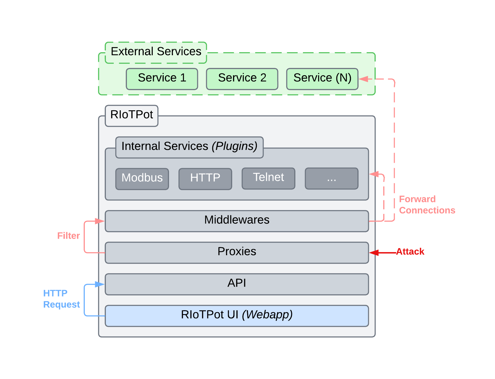

| :loudspeaker: ATTENTION!!! |
|:---------------------------|
| This repository has been moved to [the Honeynet Project](https://github.com/honeynet/riotpot) :) |

# RIoTPot

<!-- markdownlint-disable MD033 -->
<div align="center" style="box-shadow: 0px 4px 4px rgba(0, 0, 0, 0.25); background-color: #EDF2F4; border-radius: 4px; margin: 2em 0;">
  
  <div>
    <!-- Workflow status -->
    <a href="https://github.com/aau-network-security/RIoTPot/actions">
        
    </a>
    <a href="https://pkg.go.dev/riopot">
        
    </a>
    <a href="https://goreportcard.com/badge/github.com/aau-network-security/RIoTPot">
        
    </a>
    <a href="">
        
    </a>
  </div>
</div>

RIoTPot is a hybrid interaction honeypot, primarily focused on the emulation IoT and OT protocols, although, it is also capable of emulating other services.
In essence, RIoTPot acts as a proxy service for other honeypots included in the system.
Therefore, you can run any honeypot and other services alongside RIoTPot.
In addition, there is an UI web-application that you can use to manage your routing.

The honeypot comes with multiple low-interaction services ready to use.
Since these services are written as [plugins](https://pkg.go.dev/plugin), they are only supported on Linux; however, you can start RIoTPot without them.
The following table contains the list of services included in RIoTPot by defaul, their internal port, and proxy port.

<div align="center">

| Service | Internal Port | Proxy Port |
| ------- | ------------- | ---------- |
| Echo    | 20007         | 7          |
| SSH     | 20022         | 22         |
| Telnet  | 20023         | 23         |
| HTTP    | 28080         | 80         |
| Modbus  | 20502         | 502        |
| MQTT    | 21883         | 1883       |
| CoAP    | 25683         | 5683       |

</div>

> ## Table of Contents
>
> - [RIoTPoT](#riotpot)
>   - [1. Architecture](#1-architecture)
>   - [2. How to use RIoTPot](#2-how-to-use-riotpot)
>   - [3. Commands](#3-commands)

## 1. Architecture

The RIoTPot architecture is based on proxy connections to internal and surrounding (or external) services (e.g., honeypots, full-services, containers, remote hosts, etc.).
For this, the honeypot manages a number of user-defined `proxies` that relays connections between services and RIoTPot [^proxies].
This way, RIoTPot can decide how and where to route incomming attacks.
The logic used to determine how to handle the incomming attack is implemented in the form of `middlewares` [^middlewares].
To manage services, middlewares and proxies, RIoTPot ships with a REST API [^api] and a webapp UI [^ui] out-of-the-box.
The UI can be accessed through your browser at `localhost:2022` and you can fiddle with API endpoints at `localhost:2022/api/swagger` showing a [Swagger](https://swagger.io/) interface.

[^proxies]: Internal and surrounding services are not accessible through the Internet.
    Internal services are integrated and only accessible to RIoTPot.
    These services are loaded on-start and can not be deleted, but they can be stopped.
    Surrounding services **must** be in the same network as RIoTPot.
    External services **must** whitelist RIoTPot **only**.

[^middlewares]: Middlewares are currently under development.

[^api]: The RIoTPot API **must not** be exposed to the Internet.
    Regardless, the API currently only accepts connections from the localhost.
    This may be changed in the future, providing a whitelist of hosts and standard authentication.

[^ui]: Although the Web interface can be used as a separate component, it is embeded with the RIoTPot binary.

**Figure 1** shows the RIoTPot architecture, including the two main applications that constitute RIoTPot (RIoTPot itself, and RIoTPot UI) and their components, and a section to enclose external (or adjacent) services.

<div align="center" style="margin: 2em 0">
    <div style="max-width: 60%; text-align: justify; display: flex; flex-direction: column;">
        
        <div>
        <b>Figure 1.</b> RIoTPot Architecture, including the main application, external services and the webapp UI to manage RIoTPot instances.
        </div>
    </div>
</div>

RIoTPot is written in [Golang](https://go.dev/)[^os].
Each RIoTPot instance exposes registered proxies (based on their port) on demand.
To serve a proxy, it **must** have a binded service and the proxy port **must** be available (currently, RIoTPot does not accept multiple services running in the same port).
When a proxy has been binded and served, attackers will be able to send messages to RIoTPot on that port, relying the messages to the binded service and back to the attacker[^reversed].

[^os]: While the base application is interoperable, internal services (plugins) can only be used in [Linux, FreeBSD and macOS environments](https://pkg.go.dev/plugin).
    We plan to overcome this limitation by replacing plugins with micro-services communicating through [gRPC](https://grpc.io/).

[^reversed]: For ethical and security reasons, RIoTPot does not allow unsolicited requests to the outside, i.e., reversed shells and the like are not allowed.

For ease of access, multiple instances of RIoTPot can be managed from the RIoTPot UI webapp.
In addition to managing the proxies registered in each instance, the UI allows you to create, use and edit `profiles`.
Each profile contains a number of proxies named after protocols or other services making a RIoTPot instance resemble a real-life devices (e.g. a home assistant).
In few words, profiles speed up the process of setting up and provision a RIoTPot instance with specific configurations.
The UI is written using the React fonrt-end JavaScript library (we use Typescript for this project) and [Recoil](https://recoiljs.org/) state management library.
Since RIoTPot is rather small, for the moment, it does not use a database.

## 2. How to use RIoTPot

Running RIoTPot is relatively simple.
Overall, you have three options.
**The first** is to download a RIoTPot release; you can either choose to download the latest release, or previous one.
**The second option** is to build the project yourself.
**The last option** is to use the source code to create a Docker container with RIoTPot and some additional applications to enhance the honeypot.

<details open>
    <summary><b>Using a Release Version</b></summary>

> **_Info_:** This guide is meant for users with no special needs, who want a simple out-of-the-box experience.

Each release comes in a folder named `riotpot` with an executable binary (also) named `riotpot` and a `plugins` folder filled with multiple services (or low-interaction honeypots).
It is important to keep the internal folder structure for RIoTPot to work as intended.

    📁 riotpot
        ┕ riotpot
        ┕ 📁 plugins

---

1. First, download the release of your choice from the [releases](https://github.com/aau-network-security/riotpot/releases) page. Choose the one you need for your Operative System (OS).
2. Extact the `riotpot` folder.
3. Run the `riotpot` binary. This will start RIoTPot with the API enabled, all the plugins ready to use, and the UI server.
    - The API and UI are accessible through the address `localhost:2022`

</details>

<details>
    <summary><b>Build it yourself</b></summary>

> **_Info_:** This guide is meant for advanced users confortable in development environments.

<blockquote>
<details>
<summary><b>Requirements</b></summary>

- Golang - Required to build the project
- Node - Required to build the UI

**Optional**:

- Git - Used to download the source code
- Make - To run already-prepared commands

</details>
</blockquote>

---

1. Download the RIoTPot source code from GitHub. Open a console and introduce the following line.

    ```bash
    git clone git@github.com:aau-network-security/riotpot.git
    ```

2. Navigate to the folder in where you have downloaded the RIoTPot source and install the required node packages.

    ```bash
    npm install
    ```

3. If you have installed [Make](https://www.gnu.org/software/make/), we have included multiple command helpers to assist you building the project. To put it simple, you can run two simple commands that will build the RIoTPot binary and the plugins (and place them in the right folder).

    ```bash
    # Build the server
    make build-ui
    # Builds RIoTPot and the plugins
    make riotpot-build
    ```

> **__NOTE__:** The UI uses [Vite](https://vitejs.dev/) to build the project. If you prefer to use another builder, you may need to make a few changes first on your own.

</details>

<details>
    <summary><b>Docker (Virtualisation)</b></summary>

> **_Info_:** This guide is meant for advanced users who prefer to use RIoTPot in a virtual environment.

<blockquote>
<details>
<summary><b>Requirements</b></summary>

- Docker - Used to build an image of a RIoTPot instance and UI server.
- Docker-compose - Used to create a single container with a RIoTPot instance, the UI and other applications and services.

</details>
</blockquote>

The main advantages of using this setup are the additional security features with minimal changes to the container configuration and the containers themselves.
For example, we can define separated virtual private networks and overlay networks to hide, sandbox and encapsule RIoTPot and other adjacent services.
In addition, containers allow us to bind services using their docker addres name rather than their IP, which is very convenient.
Lastly, we can spawn and stop separated containers on demand without affecting other services.

On the other hand, virtualisation is arguably more demanding than usign applications on bare-metal.
While a single instance of RIoTPot is relatively lightweight, it is important to consider the shortcomings introduced by virtualisation and hardware emulation (e.g., reponse delays).

> **_Warning_:** Technically speaking, a dedicated attacker may realize that RIoTPot is in fact a honeypot by analysing and comparing the response-time delays introduced by virtualisation to real servers (!!). While this type of honeypot fingerprinting has been studied before, the results for common Internet services are still inconclussive (e.g., HTTP, Telnet and SSH), due to the commoditization of cloud hosting services using virtual machines and detailed server configurations.

The `docker-compose` file includes additional services to enhance the RIoTPot experience.
The following table summarises the list of services and applications packed in this container.

<blockquote>
<details>
<summary><b>Services</b></summary>
<div align="center">

| Service | Image                  | Port | Details                                    |
| ------- | ---------------------- | ---- | ------------------------------------------ |
| MQTT    | eclipse-mosquitto      | 1883 | Mosquito  MQTT Server                      |
| HTTP    | httpd                  | 80   | Regular HTTP Server                        |
| Modbus  | oitc/modbus-server     | 502  | Modbus Server                              |
| OCPP    | ocpp1.6-central-system | 443  | OCPP v1.6 (used in cars charging stations) |

</div>
</details>

<details>
<summary><b>Applications</b></summary>
<div align="center">

| Application | Image           | Details                                                   |
| ----------- | --------------- | --------------------------------------------------------- |
| TCPDump     | kaazing/tcpdump | Packet recorder. It stores network traffic in .pcap files |

</div>
</details>
</blockquote>

---

The container can be setup in three simple steps:

1. Download the RIoTPot source code from GitHub. Open a console and introduce the following line.

    ```bash
    git clone git@github.com:aau-network-security/riotpot.git
    ```

2. Navigate to the folder in where you have downloaded the RIoTPot source.
3. With Docker running: if you have Make installed, run the following command. Otherwise run a docker-compose command using the docker-compose file included in the `build/docker` folder.
    - With make
  
    ```bash
    # With make
    make up
    ```

   - With Docker-compose

    ```bash
    # With docker-compose
    docker-compose -p riotpot -f build/docker/docker-compose.yaml up -d --build
    ```

</details>

## 3. Commands

RIoTPot comes with flag commands that affect how and what is started.
Example:
```bash
# Run RIoTPot without the ui
./riotpot --ui false
```

 | Flag      | Type    | Default                                | Description                                              |
 | --------- | ------- | -------------------------------------- | -------------------------------------------------------- |
 | debug     | Boolean | false                                  | Set log level to debug                                   |
 | api       | Boolean | true                                   | Whether to start the API                                 |
 | plugins   | Boolean | true                                   | Whether to load the low-interaction honeypot plugins     |
 | whitelist | String  | http://localhost,http://localhost:3000 | List of comma separated allowed hosts to contact the API |
 | ui        | Boolean | true                                   | Whether to start the UI                                  |
 
